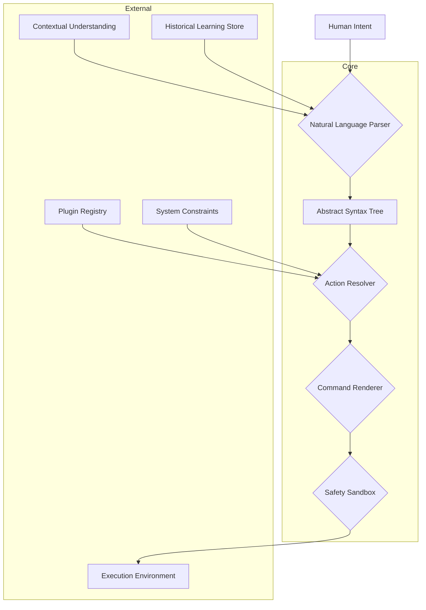

# PlainSpeak Architecture Overview

This document provides a comprehensive overview of PlainSpeak's architecture, detailing the core components, their interactions, and the design principles that guide the system.

## System Architecture

PlainSpeak follows a modular architecture with clear separation of concerns:



## Core Components

### 1. Natural Language Parser

**Purpose:** Transforms natural language into a structured representation.

**Implementation:**
- Uses a local LLM (Language Model) such as MiniCPM or Llama variants
- Implemented using `ctransformers` for efficient inference
- Enhanced with rule-based post-processing for improved accuracy

**Key Files:**
- `plainspeak/parser/llm_parser.py` - Main parser implementation
- `plainspeak/parser/prompt_templates.py` - LLM prompts
- `plainspeak/parser/utils.py` - Helper functions

**Interfaces:**
```python
def parse(text: str, context: dict = None) -> AST:
    """Parse natural language text into an Abstract Syntax Tree."""
```

### 2. Abstract Syntax Tree (AST)

**Purpose:** Provides a structured representation of user intent.

**Implementation:**
- Python dataclasses for type safety
- Represents actions, objects, filters, and relationships

**Key Files:**
- `plainspeak/ast/base.py` - Base AST node classes
- `plainspeak/ast/actions.py` - Action-specific nodes
- `plainspeak/ast/validators.py` - Validation utilities

**Core Structure:**
```python
@dataclass
class Action:
    verb: str
    parameters: Dict[str, Any] = field(default_factory=dict)
    modifiers: List[Modifier] = field(default_factory=list)
```

### 3. Action Resolver

**Purpose:** Connects abstract intentions to concrete implementations.

**Implementation:**
- Maps AST verbs to plugin implementations
- Handles disambiguation when multiple plugins match
- Resolves parameters based on context and defaults

**Key Files:**
- `plainspeak/resolver/action_resolver.py` - Main resolver
- `plainspeak/resolver/context.py` - Contextual resolution
- `plainspeak/resolver/constraints.py` - System constraints

**Interfaces:**
```python
def resolve(ast: AST, plugins: List[Plugin]) -> ResolvedAction:
    """Resolve an AST to a specific plugin action."""
```

### 4. Command Renderer

**Purpose:** Generates actual commands from resolved actions.

**Implementation:**
- Uses Jinja2 templates for flexible command generation
- Handles platform-specific command differences
- Includes safety filters and validation

**Key Files:**
- `plainspeak/renderer/jinja_renderer.py` - Jinja2-based renderer
- `plainspeak/renderer/filters.py` - Custom template filters
- `plainspeak/renderer/platform.py` - Platform-specific rendering

**Interfaces:**
```python
def render(action: ResolvedAction) -> Command:
    """Render a resolved action into an executable command."""
```

### 5. Safety Sandbox

**Purpose:** Provides a controlled environment for command execution.

**Implementation:**
- Shows commands for user approval before execution
- Uses `shlex` for secure command parsing
- Implements resource limits and permission checks

**Key Files:**
- `plainspeak/sandbox/executor.py` - Command execution
- `plainspeak/sandbox/checks.py` - Safety validation
- `plainspeak/sandbox/permissions.py` - Permission handling

**Interfaces:**
```python
def execute(command: Command, confirm: bool = True) -> ExecutionResult:
    """Execute a command in a controlled sandbox."""
```

## Supporting Systems

### 1. Plugin System

**Purpose:** Enables extensible functionality through plugins.

**Implementation:**
- YAML-based plugin definition for simple cases
- Python class-based plugins for complex functionality
- Entry point discovery for third-party plugins

**Key Files:**
- `plainspeak/plugins/base.py` - Plugin base classes
- `plainspeak/plugins/registry.py` - Plugin discovery and registration
- `plainspeak/plugins/yaml_plugin.py` - YAML plugin implementation

**Plugin Structure:**
```python
class Plugin:
    def __init__(self, name: str, description: str):
        self.name = name
        self.description = description

    def get_verbs(self) -> List[str]:
        """Return verbs this plugin handles."""

    def process_intent(self, intent: Intent) -> CommandResult:
        """Process an intent and return a command result."""
```

### 2. Learning System

**Purpose:** Improves PlainSpeak's performance based on user feedback.

**Implementation:**
- SQLite database for persistent storage
- Records command history and user feedback
- Uses patterns to improve future suggestions

**Key Files:**
- `plainspeak/learning/store.py` - Storage implementation
- `plainspeak/learning/feedback.py` - Feedback collection
- `plainspeak/learning/analysis.py` - Pattern analysis

**Key Features:**
- Command history tracking
- User feedback collection (accepts, rejects, edits)
- Pattern extraction and reuse

### 3. Contextual Understanding

**Purpose:** Maintains state across user interactions.

**Implementation:**
- Session state tracking
- Environment variable integration
- Reference resolution (e.g., "them" in "compress them")

**Key Files:**
- `plainspeak/context/session.py` - Session state
- `plainspeak/context/environment.py` - Environment integration
- `plainspeak/context/references.py` - Reference resolution

### 4. Command-Line Interface

**Purpose:** Provides the user interface for PlainSpeak.

**Implementation:**
- Built on `cmd2` for enhanced REPL capabilities
- Integrated with `typer` for CLI argument handling
- Rich output formatting with `rich`

**Key Files:**
- `plainspeak/cli/shell.py` - Interactive shell
- `plainspeak/cli/commands.py` - Command definitions
- `plainspeak/cli/app.py` - Application entry points

## Data Flow

Here's how data flows through the system:

1. User enters a natural language command
2. Command is parsed into an Abstract Syntax Tree (AST)
3. Action Resolver maps the AST to a plugin and specific action
4. Command Renderer generates the actual command using templates
5. Safety Sandbox displays the command and waits for user confirmation
6. Command is executed and results are displayed
7. Feedback is collected and stored for learning

## Configuration System

**Purpose:** Allows customization of PlainSpeak behavior.

**Implementation:**
- TOML configuration files
- Environment variable overrides
- Command-line arguments

**Key Files:**
- `plainspeak/config/loader.py` - Configuration loading
- `plainspeak/config/default.py` - Default settings
- `plainspeak/config/schema.py` - Configuration schema

**Default Location:** `~/.config/plainspeak/config.toml`

## Design Principles

PlainSpeak's architecture embodies several key design principles:

1. **Privacy by Design:** Local processing and explicit user confirmation
2. **Progressive Learning:** System improves from collective usage
3. **Extensibility:** Plugin architecture for community expansion
4. **Transparency:** Users see and approve all commands before execution
5. **Cross-Platform:** Works consistently across operating systems

## Technology Stack

- **Primary Language:** Python 3.11+
- **LLM Inference:** `ctransformers` with GGUF models
- **REPL Shell:** `cmd2`
- **Template System:** `Jinja2`
- **Type Checking:** `pydantic` and static type hints
- **CLI Framework:** `typer`
- **Learning Store:** SQLite + `pandas`
- **Distribution:** `PyInstaller`

## Performance Considerations

- **Memory Usage:** Optimized for 2-4GB RAM usage
- **Startup Time:** Under 2 seconds on modern hardware
- **Response Time:** 100-500ms for command translation
- **Storage:** <500MB for application, 1-4GB for language models

## Security Model

PlainSpeak's security is built around:

1. **Local Processing:** All NLP happens on the user's machine
2. **Explicit Confirmation:** No command executes without approval
3. **Sandboxed Execution:** Commands run with appropriate restrictions
4. **Path Safety:** Verifies file paths against security rules
5. **Resource Limits:** Constrains CPU, memory, and process usage

## Debugging and Observability

- **Logging:** Comprehensive logging via Python's logging module
- **Debug Mode:** Detailed output via `--debug` flag
- **Tracing:** Command execution tracing for troubleshooting
- **Metrics:** Optional performance metrics collection

## Future Architecture Directions

- **Multi-Model Support:** Pluggable LLM backend system
- **Distributed Plugins:** Remote plugin execution capabilities
- **Advanced Workflows:** Multi-step operations with conditional logic
- **Memory System:** Enhanced contextual memory across sessions
- **DataSpeak Integration:** SQL generation for data operations

## Development Workflow

- **Code Style:** PEP 8, Black, Flake8, MyPy
- **Testing:** Pytest with extensive unit and integration tests
- **CI/CD:** GitHub Actions for continuous integration
- **Documentation:** Sphinx for API docs, Markdown for guides

## Appendix: File Structure

```
plainspeak/
├── __init__.py
├── ast/              # Abstract Syntax Tree
├── cli/              # Command-line interface
├── config/           # Configuration handling
├── context/          # Contextual understanding
├── learning/         # Learning system
├── parser/           # Natural language parsing
├── plugins/          # Plugin system
│   ├── base.py
│   ├── builtin/      # Built-in plugins
│   └── registry.py
├── renderer/         # Command rendering
├── sandbox/          # Safety and execution
└── utils/            # Utility functions
```
