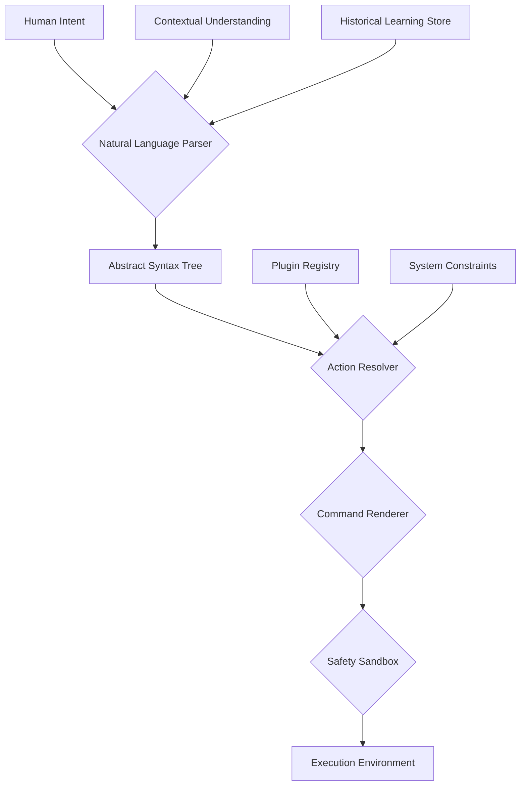

# PlainSpeak: A Proposal to the Python Software Foundation

## Executive Summary

PlainSpeak represents a transformative approach to human-computer interaction, enabling natural language commands across computing platforms. We propose donating the PlainSpeak specification to the Python Software Foundation (PSF), establishing a formal Working Group to oversee its development, and integrating it into the broader Python ecosystem. This proposal seeks PSF endorsement and support to establish PlainSpeak as a standard interface for Python-powered applications.

## Project Overview

PlainSpeak transforms natural language into precise computer operations through a highly modular, extensible architecture written in Python. At its core, PlainSpeak embodies three fundamental principles:

1. **Universal Access**: Computing power should be accessible to all humans through their natural language.
2. **Transparent Power**: Users should understand what their computer is doing on their behalf.
3. **Progressive Learning**: Systems should meet users where they are while creating pathways to deeper understanding.

## Current State and Achievements

After substantial development, PlainSpeak has achieved the following key milestones:

- **Robust Plugin System**: A well-defined architecture for extending functionality
- **Comprehensive Natural Language Processing**: Local inference with fallback to remote services
- **Cross-Platform Support**: Works on Linux, macOS, and Windows
- **Internationalization**: Support for multiple languages including English, French, and German
- **Extensive Test Suite**: Unit, integration, and end-to-end tests with high coverage
- **Comprehensive Documentation**: Both user and developer documentation

## Value to the Python Ecosystem

PlainSpeak brings significant value to the Python ecosystem:

1. **Accessibility**: Lowers the barrier to computing for non-technical users
2. **Interoperability**: Provides a standard interface for natural language processing
3. **Education**: Creates pathways for users to gradually learn more about command-line operations
4. **Innovation**: Establishes Python as a leader in natural language interfaces
5. **Community Growth**: Attracts new developers and users to the Python ecosystem

## Technical Architecture

PlainSpeak follows a modular architecture with clear separation of concerns:

This architecture allows for:

- **Extensibility**: Plugins can provide new functionality
- **Safety**: Commands are previewed and approved before execution
- **Cross-Platform Support**: Platform-specific implementations hide in plugins
- **Internationalization**: Language processing is separated from command generation

## Proposed PSF Working Group

We propose establishing a PSF Working Group for PlainSpeak with the following characteristics:

### Structure
- **Chair**: Initial project lead with rotating responsibilities
- **Core Team**: 5-7 members with diverse expertise and backgrounds
- **Contributors**: Open participation governed by the PSF's Code of Conduct

### Responsibilities
- Maintain the PlainSpeak specification
- Review and approve changes to core architecture
- Oversee plugin standards and compatibility
- Promote integration with other Python projects
- Ensure documentation quality and accessibility
- Support internationalization efforts

### Governance Model
- **Decision Making**: Consensus-seeking with voting as a fallback
- **Membership**: Open application process with core team approval
- **Meetings**: Monthly public meetings with published minutes
- **Transparency**: Public issue tracking, mailing list, and meeting notes

## Integration Plan

With PSF support, we plan to:

1. **Transfer Intellectual Property**: Donate the PlainSpeak specification and core codebase to the PSF
2. **Establish Working Group**: Form the initial team and set up infrastructure
3. **Create PEP**: Submit a Python Enhancement Proposal for standardizing natural language interfaces
4. **Community Outreach**: Engage with Python communities to build awareness and contribution
5. **Release Plan**: Develop a structured plan for stable releases and versioning

## Resource Requirements

The Working Group would require:

- PSF infrastructure for issue tracking, code hosting, and documentation
- Meeting space at PyCon and regional Python conferences
- Minimal funding for potential documentation sprints
- PSF endorsement for community outreach

## Conclusion and Next Steps

PlainSpeak represents a generational opportunity to transform how humans interact with computers through Python. With PSF support, this technology can become a standard component of the Python ecosystem, furthering the PSF's mission to promote, protect, and advance the Python programming language.

We request:
1. Initial PSF feedback on this proposal
2. Guidance on the formal process for establishing a Working Group
3. Appointment of a PSF liaison to assist with the transition process

---

## Contact Information

*[Project Lead Contact Information]*

## Appendices

### A. Current Maintainers
### B. Technical Specification Details
### C. Example Use Cases 