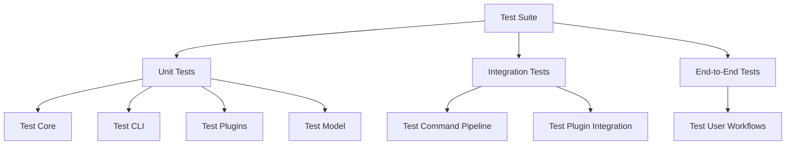
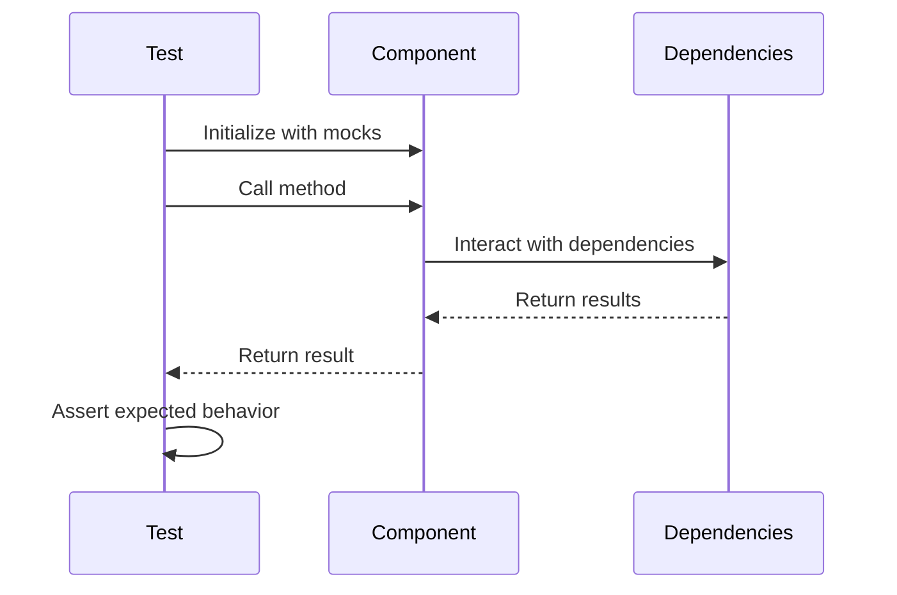
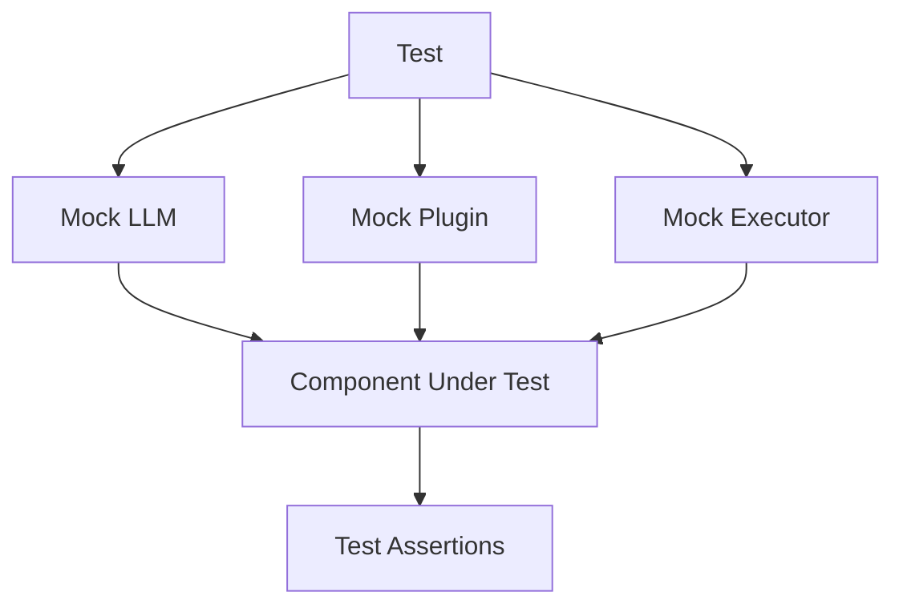
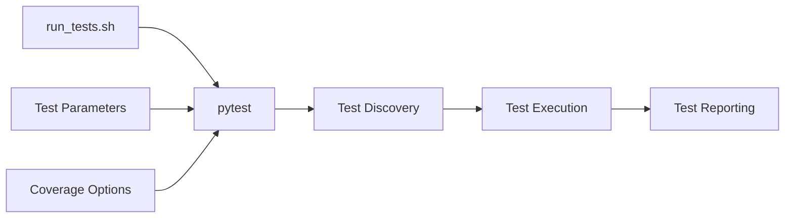
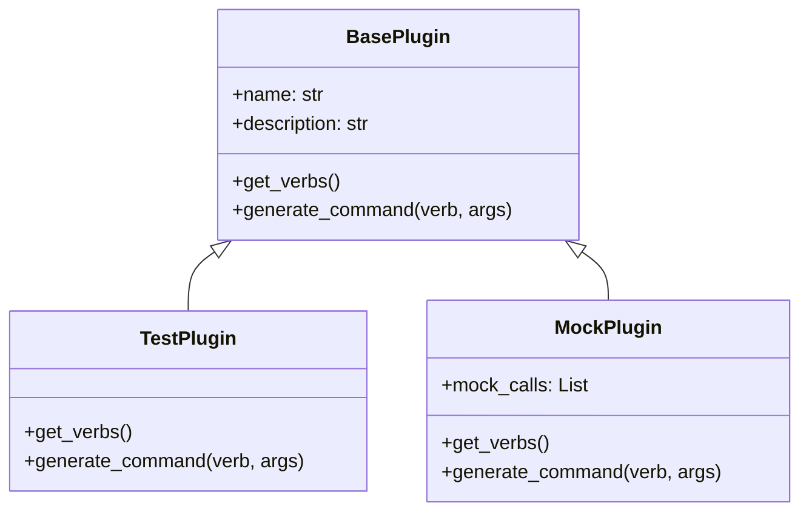
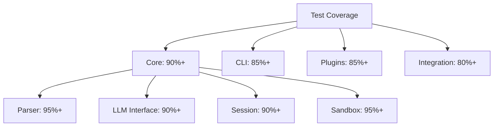

# PlainSpeak Tests

This directory contains the test suite for PlainSpeak, ensuring the reliability and correctness of the codebase.

## Test Architecture



## Test Categories

- **Unit Tests**: Test individual components in isolation
  - **test_core/**: Tests for core functionality
  - **test_cli/**: Tests for command-line interface
  - **test_plugins/**: Tests for plugin system and individual plugins
  - **test_model/**: Tests for language model integration
- **Integration Tests**: Test interactions between components
  - **test_integration.py**: Tests for the command generation and execution pipeline
- **End-to-End Tests**: Test complete user workflows
  - **test_end_to_end.py**: Tests for the complete flow from natural language to command execution

## Test Flow



## Mock Architecture



## Running Tests



## Test Plugins

The test suite includes special test plugins for testing the plugin system:



## Test Coverage

The test suite aims to provide comprehensive coverage of the codebase:



## Running the Tests

To run the tests, use the provided script:

```bash
# Run all tests
./scripts/run_tests.sh

# Run tests with verbose output
./scripts/run_tests.sh -v

# Run specific tests
./scripts/run_tests.sh tests/test_core
```
